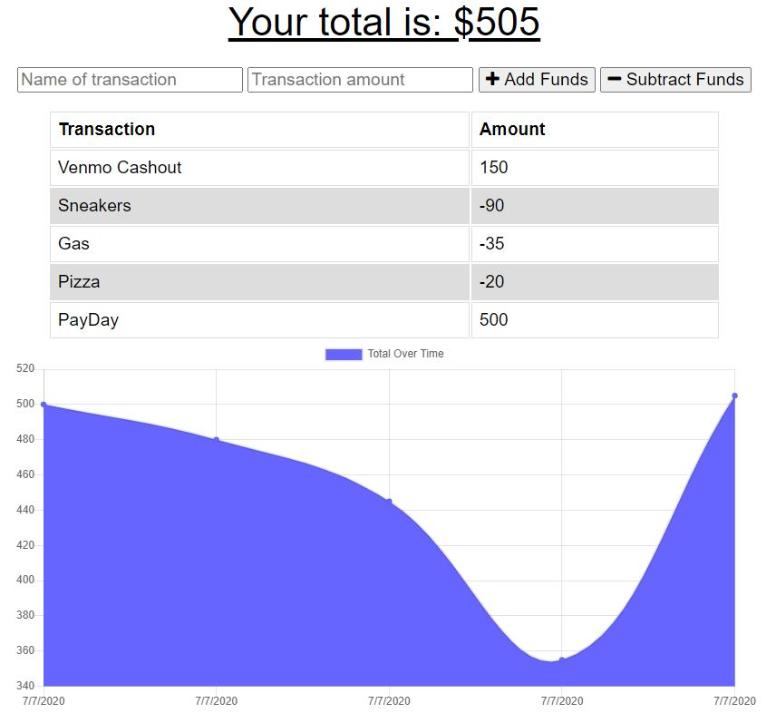

## Budget-Tracker


## Description
Week 18 Homework - Budget Tracker

## Motivation
This project will present users with a tool to track their spending and finances both with an online database and support for offline functionality. Techniques practiced in completing this project will be focused around taking an existing online application and modifying it to work without a network connection as well.

## Code Style
This project is written using JavaScript and uses the Mongoose Object Modeling package to communicate with the MongoDB server. Several PWA requirements are included as well, including a service worker, and manifest.

Offline calls are intercepted by the service worker before being parsed and supplied with the previously cached version of the request.

```javascript
    if (evt.request.url.includes("/api/")) {
      evt.respondWith(
        caches.open(DATA_CACHE_NAME).then(cache => {
          return fetch(evt.request)
            .then(response => {
              // If the response was good, clone it and store it in the cache.
              if (response.status === 200) {
                cache.put(evt.request.url, response.clone());
              }
  
              return response;
            })
            .catch(err => {
              console.log(evt.request)
              // Network request failed, try to get it from the cache.
              return cache.match(evt.request);
            });
        }).catch(err => console.log(err))
      );
  ```

Similarly, offline database submissions are instead stored in IndexedDB to later be synced with MongoDB when the network is again available.

  ```javascript
function saveRecord(record) {
  const transaction = db.transaction(["pending"], "readwrite");
  const store = transaction.objectStore("pending");
  store.add(record);
}
  ```

An event listener detects when the network is again available and syncs the pending changes with MongoDB.

  ```javascript
  const transaction = db.transaction(["pending"], "readwrite");
  const store = transaction.objectStore("pending");
  const getAll = store.getAll();

  getAll.onsuccess = function () {
    if (getAll.result.length > 0) {
      fetch("/api/transaction/bulk", {
        method: "POST",
        body: JSON.stringify(getAll.result),
        headers: {
          Accept: "application/json, text/plain, */*",
          "Content-Type": "application/json",
        },
      })
        .then((response) => response.json())
        .then(() => {
          const transaction = db.transaction(["pending"], "readwrite");
          const store = transaction.objectStore("pending");
          store.clear();
        });
    }
  };
  ```

This is a single page application. Data is reflected in real time as amounts are either added or subtracted.




## Features
Data is stored while offline and pushed to the server when the network is available.

Cached api requests are stored to be served when the network is unavailable.

# How to Use
Dependencies must be installed individually or via package.json file
* Express
* Mongoose
* Morgan
* Compression

From the landing page, enter an amount as well as a description of what the transaction represents. For incoming funds, record the transaction as an addition of funds, and for costs record it as a subtraction of funds.
